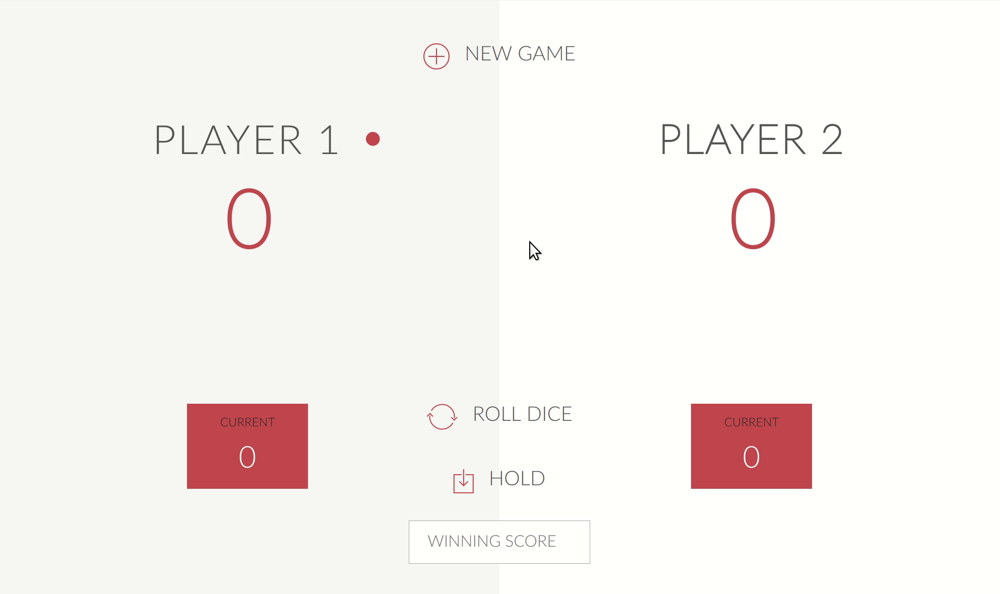

# Pig Game

Lei Mao

## Introduction

This [pig game](https://en.wikipedia.org/wiki/Pig_(dice_game)) is a simple dice game implemented using JavaScript, HTML and CSS. The majority of the HTML and CSS code were borrowed from ["The Complete JavaScript Course"](https://www.udemy.com/the-complete-javascript-course/) from Udemy with slight modification. This project also serves as my first formal step to JavaScript based web applications.

## Rules

The rule of the game is as follows:

Each turn, a player repeatedly rolls two dies until either at least a 1 is rolled or the player decides to "hold":

* If the player rolls at least a 1, they score nothing and it becomes the next player's turn.
* If the player rolls any other number, it is added to their turn total and the player's turn continues.
* If a player chooses to "hold", their turn total is added to their score, and it becomes the next player's turn.

The player is allowed to set the score to win. The default winning score is 100.


## Dependencies

* Surge 0.20.1

## Files

```
.
├── app-advanced.js
├── app.js
├── css
├── demo
├── fonts
├── images
├── index-advanced.html
├── index.html
├── LICENSE.md
├── README.md
├── style.css
└── surge-deploy

```

## Deploy on Surge

In ``surge-deploy``, run the following command in the terminal:

```bash
$ surge .
```

You may have to change the CNAME to your own domain.

## Play the Game

Please visit [http://pig-game.leimao.surge.sh/](http://pig-game.leimao.surge.sh/) to play.

<p align="center">
    
</p>

## Reference

* [Save CSS Locally](https://stackoverflow.com/questions/27055003/easiest-way-to-save-cdn-css-resource-locally)
* [The Complete JavaScript Course](https://www.udemy.com/the-complete-javascript-course/)